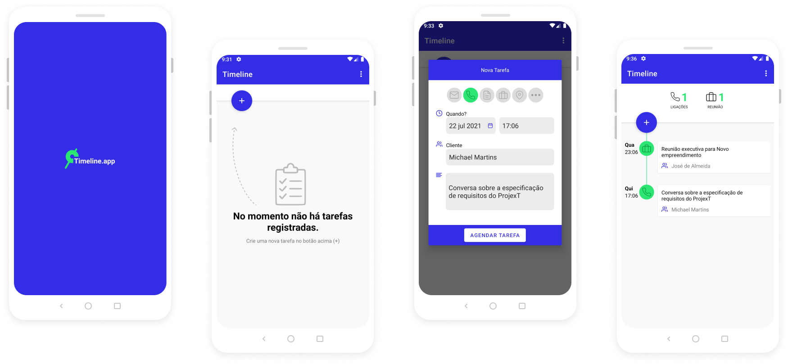
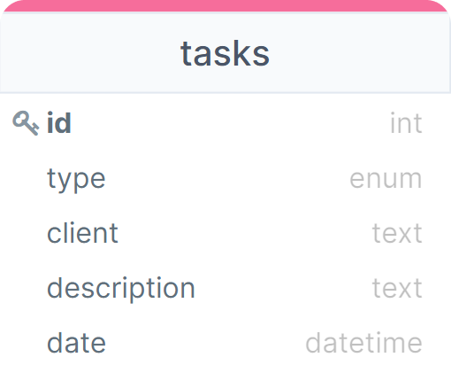

<h2 align="center">
    
</h2>

✅ Um projeto para registro de tarefas do usuário

  <row>
    
    
    
    
  </row>

 

## 📱 Captura de telas
 

  

## 🚀 Tecnologias

Esse projeto foi desenvolvido com as seguintes tecnologias, bibliotecas e arquitetura:

- [Android Nativo](https://developer.android.com/)
- [Kotlin](https://kotlinlang.org/)
- [Room](https://developer.android.com/jetpack/androidx/releases/room?hl=pt-br)
- [Jetpack](https://developer.android.com/jetpack/androidx/explorer?case=todas)
- [MVVM](https://developer.android.com/jetpack/guide)

## 💻 Sobre

Esse projeto visa atender às necessidades de usuários para registro e controle de suas tarefas no dia-a-dia. Com o aplicativo é possível registrar tarefas, atribindo tipo, data e horário, nome de cliente e descrição da tarefa.

### > Banco de dados

    
    <h5 align="center">Foi necessário para esse projeto apenas uma tabela no banco de dados. </h5>

## 🔖 Layout

O layout elaborado para esse projeto, foi a partir de um wireframe  disponibilizado por terceiros. Para tornar o wirefram com layout de alta fidelidade, foi criado um projeto no [Figma](https://www.figma.com/about/) para os devidos ajustes e criação dos esquemas de cores. O projeto e o wireframe estão registrados no seguinte projeto: [Timeline App - Figma](https://www.figma.com/file/v4xQRx1ZCW19WNj79HOMDN/Agendor-Teste-Mobile?node-id=0%3A1).

## 🤔 Como contribuir?

- Faça o Fork do repositório;
- Crie uma branch com nome da sua melhoria/correção: `git checkout -b feature/your_feature_name`;
- Faça o Commit das suas alterações: `git commit -m 'feat: My new feature'`;
- Faça o Push da sua branch: `git push origin feature/your_feature_name`.
- Abra uma PR aqui 💙.

## 📝 Licença

Esse projeto possui a MIT license. Veja a [LICENÇA](LICENSE.md) para mais detalhes.

---

Create with 💙 by Michael Martins
